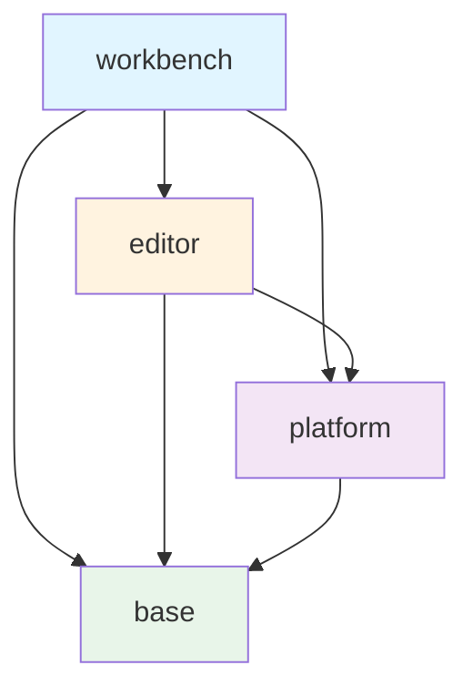
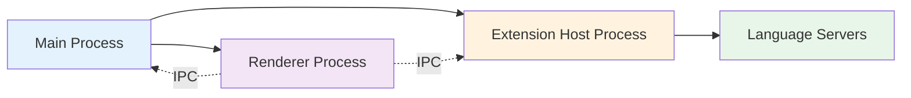

## Introduction

Visual Studio Code is built with a sophisticated **layered architecture** that combines web technologies (TypeScript, HTML, CSS) with native app capabilities through Electron. This architecture enables VS Code to run on multiple platforms (Windows, macOS, Linux) and even in the browser, while maintaining a consistent and performant user experience.

## Core Architectural Principles

VS Code's architecture is guided by several key principles:

<Accordion title="Layered Architecture">
  The codebase is organized into distinct layers, each with clear dependencies:
  - **base** → Foundation utilities and cross-platform abstractions
  - **platform** → Platform services and dependency injection infrastructure
  - **editor** → Text editor implementation with language features
  - **workbench** → Main application workbench for web and desktop
  
  Each layer can only depend on layers below it, never above.
</Accordion>

<Accordion title="Dependency Injection">
  Services are injected through constructor parameters, enabling:
  - Loose coupling between components
  - Easy testability and mocking
  - Clear service dependencies
  - Flexible service registration
</Accordion>

<Accordion title="Contribution Model">
  Features contribute to registries and extension points:
  - Commands, menus, keybindings
  - Views, editors, panels
  - Language features
  - Configuration schemas
</Accordion>

<Accordion title="Cross-Platform Compatibility">
  Abstractions separate platform-specific code:
  - Common code in `common/` folders
  - Browser-specific in `browser/` folders
  - Node.js-specific in `node/` folders
  - Electron-specific in `electron-browser/` folders
</Accordion>

## Repository Structure

The VS Code repository is organized into several top-level directories:

```
vscode/
├── src/               # Main TypeScript source code
│   └── vs/
│       ├── base/      # Foundation layer
│       ├── platform/  # Platform services layer
│       ├── editor/    # Text editor layer
│       ├── workbench/ # Workbench layer
│       ├── code/      # Electron main process
│       └── server/    # VS Code Server
├── extensions/        # Built-in extensions
├── build/            # Build scripts and CI/CD
├── test/             # Integration tests
├── scripts/          # Development scripts
├── resources/        # Static resources
└── out/              # Compiled output (generated)
```

<Note>
All unit tests are co-located with source code in `src/vs/*/test/` folders, making it easy to find and maintain tests alongside the code they verify.
</Note>

## The Layered Architecture

VS Code's architecture follows a strict layering model where dependencies flow only downward:



### Layer Descriptions

<Tabs>
  <Tab title="base">
    **Foundation Utilities** (`src/vs/base/`)
    
    Provides fundamental utilities and cross-platform abstractions that have no dependencies on other VS Code layers:
    
    - **Event system**: `Event<T>` for pub/sub patterns
    - **Lifecycle management**: `IDisposable`, `DisposableStore`
    - **Async utilities**: Promises, throttling, debouncing
    - **Data structures**: Arrays, maps, trees, linked lists
    - **Platform abstractions**: OS detection, paths, processes
    - **UI components**: Basic trees, lists, scrollbars
    
    Example: `src/vs/base/common/event.ts:1`
  </Tab>
  
  <Tab title="platform">
    **Platform Services** (`src/vs/platform/`)
    
    Provides core services and the dependency injection infrastructure:
    
    - **Instantiation service**: Dependency injection container
    - **Configuration service**: Settings management
    - **File service**: File system operations
    - **Log service**: Logging infrastructure
    - **Keybinding service**: Keyboard shortcut management
    - **Telemetry service**: Usage analytics
    
    Example: `src/vs/platform/files/common/fileService.ts:1`
  </Tab>
  
  <Tab title="editor">
    **Text Editor** (`src/vs/editor/`)
    
    The Monaco Editor - a standalone text editor component:
    
    - **Text model**: Document representation and editing
    - **View model**: Visual representation of text
    - **Language features**: Syntax highlighting, IntelliSense
    - **Editor contributions**: Find, folding, rename, etc.
    - **Standalone editor**: Can be used outside VS Code
    
    Example: `src/vs/editor/browser/editorBrowser.ts:1`
  </Tab>
  
  <Tab title="workbench">
    **Application Workbench** (`src/vs/workbench/`)
    
    The main VS Code application built on top of the editor:
    
    - **Workbench layout**: Sidebar, panel, editor area
    - **Workbench services**: Extensions, debug, search, SCM
    - **Feature contributions**: All major VS Code features
    - **Extension API**: VS Code API implementation
    
    Example: `src/vs/workbench/browser/workbench.ts:1`
  </Tab>
</Tabs>

## Built-in Extensions

The `extensions/` directory contains first-party extensions that ship with VS Code:

- **Language support**: TypeScript, JavaScript, HTML, CSS, JSON, Markdown, etc.
- **Core features**: Git integration, debugging, Emmet, search
- **Themes**: Default color themes and icon themes
- **Development tools**: Extension authoring utilities

<Note>
Built-in extensions follow the same extension API as third-party extensions, demonstrating the power and completeness of the extension API.
</Note>

## Platform-Specific Code Organization

VS Code uses a consistent folder structure to separate platform-specific code:

| Folder | Purpose | Environment |
|--------|---------|-------------|
| `common/` | Cross-platform code | All platforms |
| `browser/` | Browser-specific code | Web, Electron renderer |
| `node/` | Node.js-specific code | Desktop, server |
| `electron-browser/` | Electron renderer code | Desktop only |
| `electron-sandbox/` | Sandboxed Electron code | Desktop only |
| `electron-main/` | Electron main process | Desktop only |

<Warning>
Code in `common/` folders must not import from `browser/`, `node/`, or `electron-*` folders. This ensures true cross-platform compatibility.
</Warning>

## Multi-Process Architecture

VS Code uses multiple processes for isolation and performance:



### Process Responsibilities

<Accordion title="Main Process (Electron)">
  - Application lifecycle management
  - Window management
  - Native menus and dialogs
  - File system operations
  - Auto-update handling
  
  Located in: `src/vs/code/electron-main/`
</Accordion>

<Accordion title="Renderer Process (UI)">
  - All UI rendering (workbench, editor)
  - User interaction handling
  - Monaco Editor
  - Webviews for custom UI
  
  Located in: `src/vs/workbench/electron-browser/`
</Accordion>

<Accordion title="Extension Host Process">
  - Extension execution sandbox
  - Isolated from UI process
  - Can crash without affecting editor
  - Communicates via message passing
  
  Located in: `src/vs/workbench/api/`
</Accordion>

<Accordion title="Language Server Processes">
  - Language-specific analysis (TypeScript, Python, etc.)
  - Runs in separate processes
  - Uses Language Server Protocol (LSP)
  - Heavy computation offloaded from UI
</Accordion>

## Key Design Patterns

### Event-Driven Architecture

VS Code uses a custom event system for reactive programming:

```typescript
// From src/vs/base/common/event.ts
export interface Event<T> {
  (listener: (e: T) => unknown, thisArgs?: any, disposables?: IDisposable[]): IDisposable;
}

// Usage example
class TextModel {
  private readonly _onDidChangeContent = new Emitter<IModelContentChangedEvent>();
  readonly onDidChangeContent: Event<IModelContentChangedEvent> = this._onDidChangeContent.event;
  
  private fireContentChanged(event: IModelContentChangedEvent): void {
    this._onDidChangeContent.fire(event);
  }
}
```

### Disposable Pattern

Resources are managed through the disposable pattern:

```typescript
// From src/vs/base/common/lifecycle.ts
export interface IDisposable {
  dispose(): void;
}

class MyService extends Disposable {
  constructor() {
    super();
    // Register disposables for automatic cleanup
    this._register(this.someDisposableResource);
  }
}
```

<Warning>
Always register disposables immediately after creation. Use `DisposableStore`, `MutableDisposable`, or `DisposableMap` helpers to prevent memory leaks.
</Warning>

## Extension Points

VS Code's contribution model allows features to extend the application:

- **Commands**: Register executable commands
- **Menus**: Add items to menus and context menus
- **Keybindings**: Define keyboard shortcuts
- **Views**: Add custom views to sidebar/panel
- **Editors**: Register custom editor types
- **Languages**: Add language support
- **Configuration**: Define settings
- **Themes**: Contribute color and icon themes

See [Contribution Model](/architecture/contribution-model) for detailed information.

## Performance Considerations

<Accordion title="Lazy Loading">
  Services use `InstantiationType.Delayed` to defer instantiation until first use, reducing startup time.
</Accordion>

<Accordion title="Code Splitting">
  Features are loaded on demand using dynamic imports, keeping the initial bundle small.
</Accordion>

<Accordion title="Virtual Scrolling">
  Large lists and trees use virtual scrolling to render only visible items.
</Accordion>

<Accordion title="Web Workers">
  Heavy computation (syntax highlighting, search) runs in web workers to keep the UI responsive.
</Accordion>

## Next Steps

<CardGroup cols={2}>
  <Card title="Layered Architecture" icon="layer-group" href="/architecture/layers">
    Deep dive into each architectural layer
  </Card>
  <Card title="Dependency Injection" icon="plug" href="/architecture/dependency-injection">
    Learn how services are created and injected
  </Card>
  <Card title="Contribution Model" icon="puzzle-piece" href="/architecture/contribution-model">
    Understand how features extend VS Code
  </Card>
  <Card title="Building VS Code" icon="hammer" href="/building/compilation">
    Build VS Code from source
  </Card>
</CardGroup>
