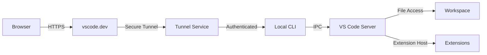

VS Code CLI provides powerful remote development capabilities through tunneling and web server modes. These features enable you to access your development environment from anywhere, run VS Code in the browser, and set up persistent remote connections.

## Overview

The CLI offers two primary modes for remote development:

<CardGroup cols={2}>
  <Card title="Tunnel Mode" icon="tunnel">
    Create secure tunnels accessible via vscode.dev from anywhere in the world
  </Card>
  <Card title="Web Server Mode" icon="browser">
    Run a local web-based instance of VS Code on your network
  </Card>
</CardGroup>

## Tunnel Mode

Tunnel mode creates a secure connection between your local machine and Microsoft's remote tunneling service, making your development environment accessible through vscode.dev.

### Basic Tunnel Usage

<Steps>
  <Step title="Start a Tunnel">
    ```bash
    code tunnel
    ```

    On first run, you'll be prompted to:
    1. Authenticate with Microsoft or GitHub
    2. Accept the server license terms
    3. Optionally name your tunnel
  </Step>

  <Step title="Access Your Tunnel">
    Once started, you'll receive a URL like:
    ```
    https://vscode.dev/tunnel/<machine-name>/<workspace>
    ```

    Open this URL in any browser to access your development environment.
  </Step>

  <Step title="Stop the Tunnel">
    ```bash
    # In another terminal
    code tunnel kill

    # Or press Ctrl+C in the tunnel terminal
    ```
  </Step>
</Steps>

### Named Tunnels

Give your tunnel a memorable name for easier access:

```bash
# Set a custom name
code tunnel --name my-dev-machine

# Use random name (for temporary tunnels)
code tunnel --random-name
```

### Tunnel Authentication

<Tabs>
  <Tab title="Interactive Login">
    Default authentication opens a browser:

    ```bash
    code tunnel user login
    ```

    Choose your provider:
    - Microsoft Account
    - GitHub Account
  </Tab>

  <Tab title="Token-Based Login">
    For headless environments or CI/CD:

    ```bash
    # GitHub
    code tunnel user login \
      --provider github \
      --access-token $GITHUB_TOKEN

    # Microsoft
    code tunnel user login \
      --provider microsoft \
      --access-token $MS_TOKEN \
      --refresh-token $MS_REFRESH_TOKEN
    ```

    <Warning>
    Store tokens securely using environment variables or secret managers. Never commit tokens to version control.
    </Warning>
  </Tab>

  <Tab title="Check Login Status">
    ```bash
    # Show current user
    code tunnel user show

    # Logout
    code tunnel user logout
    ```
  </Tab>
</Tabs>

### Tunnel Management

<CodeGroup>
```bash Status
# Check if tunnel is running
code tunnel status

# Example output (JSON):
{
  "tunnel": {
    "name": "my-dev-machine",
    "status": "connected",
    "cluster": "eus",
    "id": "abc123..."
  },
  "service_installed": false
}
```

```bash Rename
# Change tunnel name
code tunnel rename my-new-name
```

```bash Restart
# Restart running tunnel
code tunnel restart
```

```bash Unregister
# Remove tunnel registration
code tunnel unregister
```
</CodeGroup>

### Tunnel Service Mode

Run tunnels as a persistent system service that starts on boot:

<Tabs>
  <Tab title="Linux (systemd)">
    ```bash
    # Install service
    sudo code tunnel service install \
      --accept-server-license-terms \
      --name my-server

    # View logs
    code tunnel service log

    # Uninstall
    sudo code tunnel service uninstall
    ```

    The service is installed as:
    ```
    /etc/systemd/system/code-tunnel.service
    ```
  </Tab>

  <Tab title="macOS (launchd)">
    ```bash
    # Install service
    code tunnel service install \
      --accept-server-license-terms \
      --name my-mac

    # View logs
    code tunnel service log

    # Uninstall
    code tunnel service uninstall
    ```

    The service is installed as:
    ```
    ~/Library/LaunchAgents/com.microsoft.code.tunnel.plist
    ```
  </Tab>

  <Tab title="Windows (Service)">
    ```powershell
    # Install service (requires admin)
    code tunnel service install `
      --accept-server-license-terms `
      --name my-windows-pc

    # View logs
    code tunnel service log

    # Uninstall
    code tunnel service uninstall
    ```

    The service runs as a Windows Service.
  </Tab>
</Tabs>

### Advanced Tunnel Options

```bash
# Prevent machine from sleeping
code tunnel --no-sleep

# Custom server data directory
code tunnel --server-data-dir /custom/path

# Custom extensions directory
code tunnel --extensions-dir /custom/extensions

# Preinstall extensions
code tunnel --install-extension ms-python.python

# Custom reconnection grace time (seconds)
code tunnel --reconnection-grace-time 7200

# Verbose logging
code tunnel --verbose --log debug
```

## Web Server Mode

Run a local instance of VS Code accessible through a web browser on your network.

### Basic Web Server

<CodeGroup>
```bash Default
# Runs on http://localhost:8000
code serve-web
```

```bash Custom Port
code serve-web --port 3000
```

```bash Custom Host
# Bind to all interfaces
code serve-web --host 0.0.0.0 --port 8080

# Specific interface
code serve-web --host 192.168.1.100 --port 8080
```

```bash Random Port
# Let the system choose a free port
code serve-web --port 0
```
</CodeGroup>

### Authentication

Secure your web server with connection tokens:

<Tabs>
  <Tab title="Manual Token">
    ```bash
    code serve-web --connection-token mysecrettoken123
    ```

    Access via:
    ```
    http://localhost:8000?tkn=mysecrettoken123
    ```
  </Tab>

  <Tab title="Token File">
    ```bash
    # Store token in file
    echo "my-secure-token" > /secure/token.txt
    chmod 600 /secure/token.txt

    code serve-web --connection-token-file /secure/token.txt
    ```
  </Tab>

  <Tab title="Without Token">
    <Warning>
    Only use this in trusted, isolated networks!
    </Warning>

    ```bash
    code serve-web --without-connection-token
    ```
  </Tab>
</Tabs>

### Web Server Configuration

```bash
# Accept license terms (skip prompt)
code serve-web --accept-server-license-terms

# Custom server base path
code serve-web --server-base-path /vscode

# Custom data directory
code serve-web --server-data-dir ~/.vscode-server-web

# Specific commit/version
code serve-web --commit-id abc123def456

# Complete example
code serve-web \
  --host 0.0.0.0 \
  --port 8080 \
  --connection-token $(cat token.txt) \
  --server-data-dir /data/vscode-server \
  --accept-server-license-terms
```

### Socket-Based Server

Use Unix sockets instead of TCP ports:

```bash
code serve-web --socket-path /tmp/vscode.sock
```

## Remote Development Architecture

Understanding how remote connections work:



### Components

<Tabs>
  <Tab title="Client">
    **Browser (vscode.dev)**
    - Full VS Code UI
    - Runs in the browser
    - Communicates via secure WebSocket

    **Connection Flow:**
    1. Authenticate with Microsoft/GitHub
    2. Discover available tunnels
    3. Establish WebSocket connection
    4. Stream UI and interactions
  </Tab>

  <Tab title="Tunnel Service">
    **Microsoft Dev Tunnels**
    - Azure-hosted relay service
    - End-to-end encrypted
    - Global availability
    - Automatic failover

    **Authentication:**
    - Microsoft Account
    - GitHub Account
    - Access tokens for headless scenarios
  </Tab>

  <Tab title="Server">
    **VS Code Server**
    - Headless VS Code backend
    - File system access
    - Extension host
    - Terminal access
    - Language servers

    Located in `~/.vscode-server/` or custom directory.
  </Tab>
</Tabs>

## Extension Management in Remote Mode

Extensions in remote scenarios work differently:

```bash
# Install extensions for tunnel/server usage
code tunnel --install-extension ms-python.python

# Multiple extensions
code tunnel \
  --install-extension ms-python.python \
  --install-extension ms-vscode.cpptools \
  --install-extension esbenp.prettier-vscode
```

Extensions are installed in the remote server environment and run server-side.

## Security Considerations

<AccordionGroup>
  <Accordion title="Connection Security">
    - All tunnel connections are end-to-end encrypted
    - TLS/SSL for web server mode
    - Connection tokens act as authentication secrets
    - Machine names are globally unique and pseudo-anonymous
  </Accordion>

  <Accordion title="Authentication">
    - OAuth 2.0 for Microsoft/GitHub authentication
    - Access tokens should be treated as passwords
    - Use environment variables for tokens in automation
    - Refresh tokens allow reconnection without re-auth
  </Accordion>

  <Accordion title="Network Exposure">
    **Tunnel Mode:**
    - Only accessible via authenticated vscode.dev
    - No direct network exposure
    - Service manages all network routing

    **Web Server Mode:**
    - Direct network exposure
    - Use connection tokens
    - Consider firewall rules
    - Use HTTPS reverse proxy for production
  </Accordion>

  <Accordion title="Best Practices">
    - Regularly rotate connection tokens
    - Use `--no-sleep` carefully (power implications)
    - Monitor service logs
    - Use dedicated service accounts
    - Keep CLI updated
  </Accordion>
</AccordionGroup>

## Production Deployment

### Reverse Proxy Setup

Deploy web server behind nginx:

```nginx
server {
    listen 443 ssl;
    server_name code.example.com;

    ssl_certificate /etc/ssl/certs/code.example.com.crt;
    ssl_certificate_key /etc/ssl/private/code.example.com.key;

    location / {
        proxy_pass http://localhost:8000;
        proxy_http_version 1.1;
        proxy_set_header Upgrade $http_upgrade;
        proxy_set_header Connection "upgrade";
        proxy_set_header Host $host;
        proxy_set_header X-Real-IP $remote_addr;
        proxy_set_header X-Forwarded-For $proxy_add_x_forwarded_for;
        proxy_set_header X-Forwarded-Proto $scheme;
        proxy_read_timeout 86400;
    }
}
```

### Docker Deployment

<CodeGroup>
```dockerfile Dockerfile
FROM ubuntu:22.04

RUN apt-get update && apt-get install -y \
    curl \
    ca-certificates \
    && rm -rf /var/lib/apt/lists/*

# Download VS Code CLI
RUN curl -Lk 'https://code.visualstudio.com/sha/download?build=stable&os=cli-alpine-x64' \
    --output /tmp/vscode-cli.tar.gz && \
    tar -xzf /tmp/vscode-cli.tar.gz -C /usr/local/bin && \
    rm /tmp/vscode-cli.tar.gz

# Create workspace
RUN mkdir -p /workspace
WORKDIR /workspace

# Expose port
EXPOSE 8000

# Run tunnel
CMD ["code", "tunnel", "--accept-server-license-terms"]
```

```yaml docker-compose.yml
version: '3.8'

services:
  vscode-server:
    build: .
    ports:
      - "8000:8000"
    volumes:
      - workspace:/workspace
      - vscode-server:/root/.vscode-server
    environment:
      - VSCODE_CLI_ACCESS_TOKEN=${GITHUB_TOKEN}
    restart: unless-stopped

volumes:
  workspace:
  vscode-server:
```
</CodeGroup>

### Systemd Service (Manual)

Create `/etc/systemd/system/code-tunnel.service`:

```ini
[Unit]
Description=VS Code Remote Tunnel
After=network.target

[Service]
Type=simple
User=vscode
Environment="PATH=/usr/local/bin:/usr/bin:/bin"
ExecStart=/usr/local/bin/code tunnel \
  --accept-server-license-terms \
  --name production-server \
  --verbose
Restart=always
RestartSec=10

[Install]
WantedBy=multi-user.target
```

Enable and start:
```bash
sudo systemctl daemon-reload
sudo systemctl enable code-tunnel
sudo systemctl start code-tunnel
sudo systemctl status code-tunnel
```

## Troubleshooting

<AccordionGroup>
  <Accordion title="Tunnel won't connect">
    ```bash
    # Check status
    code tunnel status

    # Verify authentication
    code tunnel user show

    # Try restarting
    code tunnel restart

    # Check logs with verbose mode
    code tunnel --verbose --log debug
    ```
  </Accordion>

  <Accordion title="Connection token issues">
    ```bash
    # Generate secure token
    openssl rand -base64 32

    # Verify token is being passed correctly
    curl "http://localhost:8000?tkn=yourtoken"
    ```
  </Accordion>

  <Accordion title="Port already in use">
    ```bash
    # Find what's using the port
    lsof -i :8000  # Linux/macOS
    netstat -ano | findstr :8000  # Windows

    # Use a different port
    code serve-web --port 8001
    ```
  </Accordion>

  <Accordion title="Extension not working remotely">
    - Not all extensions support remote mode
    - Check extension marketplace for "Remote Development" support
    - Manually install on remote: `code tunnel --install-extension ext-id`
    - View logs: `code tunnel --verbose`
  </Accordion>
</AccordionGroup>

## Performance Tuning

```bash
# Increase reconnection grace time for unstable connections
code tunnel --reconnection-grace-time 14400  # 4 hours

# Custom data directory for better I/O
code tunnel --server-data-dir /fast/ssd/vscode-server

# Limit extension logging
code tunnel --log warn

# Pre-install extensions to avoid startup delay
code tunnel \
  --install-extension ms-python.python \
  --install-extension ms-vscode.cpptools
```

## Monitoring

Monitor tunnel health:

```bash
# Status check script
#!/bin/bash
while true; do
  code tunnel status > /dev/null 2>&1
  if [ $? -ne 0 ]; then
    echo "Tunnel down, restarting..."
    code tunnel restart
  fi
  sleep 60
done
```

## Next Steps

<CardGroup cols={2}>
  <Card title="Commands Reference" icon="terminal" href="/cli/commands">
    Explore all CLI commands
  </Card>
  <Card title="Installation" icon="download" href="/cli/installation">
    Installation and setup
  </Card>
</CardGroup>
