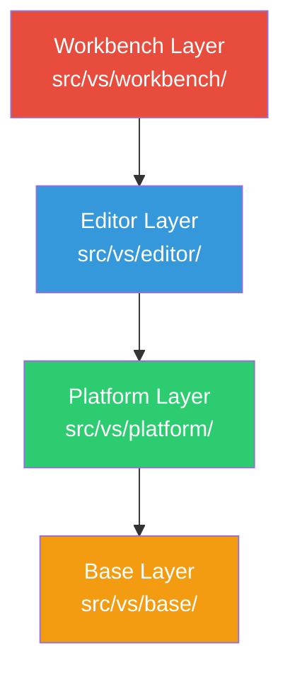
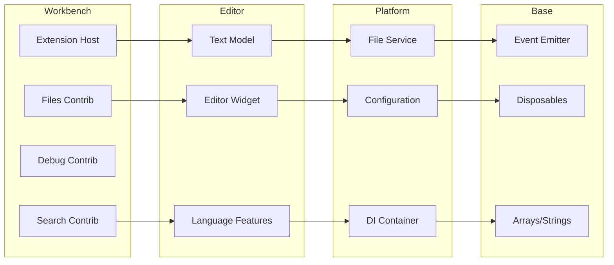

## Overview

VS Code follows a strict **layered architecture** where code is organized into distinct layers with clear dependency rules. Each layer can only depend on layers below it, never above. This design ensures:

- Clean separation of concerns
- Reusability of lower layers
- Prevention of circular dependencies
- Easier testing and maintenance

<Info>
  VS Code includes a build-time check (`npm run valid-layers-check`) that enforces these layering rules.
</Info>

## The Four Layers



<Tabs>
  <Tab title="Dependency Flow">
    ```
    ┌─────────────────────────────────────┐
    │  Workbench (Full Application)       │  ← Can use everything below
    ├─────────────────────────────────────┤
    │  Editor (Monaco Editor)             │  ← Can use Platform & Base
    ├─────────────────────────────────────┤
    │  Platform (Services & DI)           │  ← Can use Base only
    ├─────────────────────────────────────┤
    │  Base (Utilities & Primitives)      │  ← No dependencies
    └─────────────────────────────────────┘
    ```
  </Tab>
  
  <Tab title="Import Rules">
    ```typescript
    // ✅ ALLOWED: Lower layer to lower layer
    // In src/vs/platform/
    import { Event } from '../base/common/event.js';
    
    // ✅ ALLOWED: Higher layer to lower layer
    // In src/vs/workbench/
    import { IFileService } from '../platform/files/common/files.js';
    
    // ❌ FORBIDDEN: Lower layer to higher layer
    // In src/vs/platform/
    import { Workbench } from '../workbench/browser/workbench.js'; // ERROR!
    
    // ❌ FORBIDDEN: Skipping layers without reason
    // In src/vs/workbench/
    import { arrays } from '../base/common/arrays.js'; // Use platform services instead
    ```
  </Tab>
</Tabs>

## Base Layer

<Card title="Location" icon="folder">
  `src/vs/base/`
</Card>

 The **foundation** of VS Code. Contains zero-dependency utilities and primitives used by all other layers.

### Key Responsibilities

<AccordionGroup>
  <Accordion title="Common Utilities (base/common/)">
    Pure TypeScript utilities that work in any environment:
    
    - **Arrays**: `arrays.ts` - Array manipulation utilities
    - **Strings**: `strings.ts` - String processing functions
    - **Async**: `async.ts` - Promises, timeouts, idle callbacks
    - **Event**: `event.ts` - Type-safe event emitter system
    - **URI**: `uri.ts` - URI parsing and manipulation
    - **Lifecycle**: `lifecycle.ts` - Disposable pattern implementation
    - **Collections**: `map.ts`, `linkedList.ts`, `tree.ts`
    
    ```typescript
    // Example from base/common/arrays.ts
    export function coalesce<T>(array: ReadonlyArray<T | undefined | null>): T[] {
      return array.filter(e => !!e) as T[];
    }
    
    export function distinct<T>(array: ReadonlyArray<T>): T[] {
      return [...new Set(array)];
    }
    ```
  </Accordion>
  
  <Accordion title="Browser Abstractions (base/browser/)">
    Browser-specific utilities and DOM helpers:
    
    - **DOM**: `dom.ts` - DOM manipulation utilities
    - **UI**: `ui/` - Basic UI widgets (scrollbar, sash, etc.)
    - **KeyboardEvent**: `keyboardEvent.ts` - Keyboard input handling
    - **Mouse**: `mouseEvent.ts` - Mouse input handling
    
    ```typescript
    // Example from base/browser/dom.ts
    export function addDisposableListener(
      node: EventTarget,
      type: string,
      handler: EventListener
    ): IDisposable {
      node.addEventListener(type, handler);
      return {
        dispose: () => node.removeEventListener(type, handler)
      };
    }
    ```
  </Accordion>
  
  <Accordion title="Node.js Abstractions (base/node/)">
    Node.js-specific utilities (only available in Electron/Node.js environments):
    
    - **Process**: Process spawning and management
    - **File System**: `pfs.ts` - Promise-based fs operations
    - **Streams**: Stream utilities
    
    ```typescript
    // Example from base/node/pfs.ts
    export namespace Promises {
      export async function readFile(path: string): Promise<Buffer> {
        return await promises.readFile(path);
      }
      
      export async function writeFile(
        path: string,
        data: string | Buffer
      ): Promise<void> {
        return await promises.writeFile(path, data);
      }
    }
    ```
  </Accordion>
  
  <Accordion title="Event System (base/common/event.ts)">
    VS Code's type-safe event system used throughout the codebase:
    
    ```typescript
    import { Emitter, Event } from 'vs/base/common/event';
    
    class FileWatcher {
      private readonly _onDidChange = new Emitter<string>();
      readonly onDidChange: Event<string> = this._onDidChange.event;
      
      private notifyChange(path: string): void {
        this._onDidChange.fire(path);
      }
    }
    
    // Usage
    const watcher = new FileWatcher();
    watcher.onDidChange(path => {
      console.log(`File changed: ${path}`);
    });
    ```
  </Accordion>
  
  <Accordion title="Lifecycle & Disposables (base/common/lifecycle.ts)">
    The disposable pattern for resource management:
    
    ```typescript
    export interface IDisposable {
      dispose(): void;
    }
    
    export class DisposableStore implements IDisposable {
      private _toDispose = new Set<IDisposable>();
      
      public add<T extends IDisposable>(t: T): T {
        this._toDispose.add(t);
        return t;
      }
      
      public dispose(): void {
        this._toDispose.forEach(d => d.dispose());
        this._toDispose.clear();
      }
    }
    ```
  </Accordion>
</AccordionGroup>

<Warning>
  Code in the base layer should **never** import from platform, editor, or workbench layers. It must be completely self-contained.
</Warning>

## Platform Layer

<Card title="Location" icon="folder">
  `src/vs/platform/`
</Card>

Provides platform services and the **dependency injection** infrastructure. This layer defines service interfaces and implementations.

### Key Responsibilities

<AccordionGroup>
  <Accordion title="Dependency Injection (platform/instantiation/)">
    The DI system that powers VS Code:
    
    ```typescript
    // platform/instantiation/common/instantiation.ts
    
    // Create a service identifier
    export const IFileService = createDecorator<IFileService>('fileService');
    
    export interface IFileService {
      _serviceBrand: undefined;
      readFile(resource: URI): Promise<IFileContent>;
      writeFile(resource: URI, content: VSBuffer): Promise<void>;
    }
    
    // Use the service
    class MyClass {
      constructor(
        @IFileService private readonly fileService: IFileService
      ) { }
      
      async readConfig(): Promise<string> {
        const content = await this.fileService.readFile(URI.file('config.json'));
        return content.value.toString();
      }
    }
    ```
  </Accordion>
  
  <Accordion title="File System (platform/files/)">
    Abstracted file system operations:
    
    ```typescript
    // platform/files/common/files.ts
    export const IFileService = createDecorator<IFileService>('fileService');
    
    export interface IFileService {
      // File operations
      resolve(resource: URI): Promise<IFileStat>;
      readFile(resource: URI): Promise<IFileContent>;
      writeFile(resource: URI, bufferOrReadable: VSBuffer): Promise<void>;
      del(resource: URI): Promise<void>;
      
      // Watching
      watch(resource: URI): IDisposable;
      
      // Events
      readonly onDidFilesChange: Event<FileChangesEvent>;
      readonly onDidRunOperation: Event<FileOperationEvent>;
    }
    ```
  </Accordion>
  
  <Accordion title="Configuration (platform/configuration/)">
    Application and user settings:
    
    ```typescript
    export const IConfigurationService = createDecorator<IConfigurationService>(
      'configurationService'
    );
    
    export interface IConfigurationService {
      // Get configuration value
      getValue<T>(key: string): T | undefined;
      
      // Update configuration
      updateValue(key: string, value: any): Promise<void>;
      
      // Listen for changes
      onDidChangeConfiguration: Event<IConfigurationChangeEvent>;
    }
    
    // Usage
    const fontSize = configurationService.getValue<number>('editor.fontSize');
    ```
  </Accordion>
  
  <Accordion title="Logging (platform/log/)">
    Structured logging system:
    
    ```typescript
    export const ILogService = createDecorator<ILogService>('logService');
    
    export interface ILogService {
      trace(message: string, ...args: any[]): void;
      debug(message: string, ...args: any[]): void;
      info(message: string, ...args: any[]): void;
      warn(message: string, ...args: any[]): void;
      error(message: string | Error, ...args: any[]): void;
    }
    ```
  </Accordion>
  
  <Accordion title="Keybinding (platform/keybinding/)">
    Keyboard shortcut system:
    
    ```typescript
    export const IKeybindingService = createDecorator<IKeybindingService>(
      'keybindingService'
    );
    
    export interface IKeybindingService {
      // Execute a command
      executeCommand(commandId: string, ...args: any[]): Promise<any>;
      
      // Get keybindings
      getKeybindings(): readonly ResolvedKeybinding[];
      
      // Listen for changes
      onDidUpdateKeybindings: Event<void>;
    }
    ```
  </Accordion>
  
  <Accordion title="Registry (platform/registry/)">
    Global registry for extensions and contributions:
    
    ```typescript
    // platform/registry/common/platform.ts
    export namespace Registry {
      export function add(name: string, contribution: any): void;
      export function as<T>(name: string): T;
    }
    
    // Usage
    interface IMyRegistry {
      registerThing(thing: Thing): void;
    }
    
    const Extensions = {
      MyRegistry: 'my.registry'
    };
    
    Registry.add(Extensions.MyRegistry, new MyRegistryImpl());
    
    // Later
    Registry.as<IMyRegistry>(Extensions.MyRegistry).registerThing(thing);
    ```
  </Accordion>
</AccordionGroup>

<Info>
  Platform services use the **BrandedService** pattern to ensure type safety in dependency injection.
</Info>

## Editor Layer

<Card title="Location" icon="folder">
  `src/vs/editor/`
</Card>

The **Monaco Editor** - a standalone, feature-rich code editor that can be used independently of VS Code.

### Key Responsibilities

<AccordionGroup>
  <Accordion title="Text Model (editor/common/model/)">
    The text buffer and document model:
    
    ```typescript
    // editor/common/model/textModel.ts
    export interface ITextModel {
      // Content
      getValue(): string;
      getLineContent(lineNumber: number): string;
      getLineCount(): number;
      
      // Editing
      applyEdits(operations: IIdentifiedSingleEditOperation[]): void;
      pushEditOperations(
        beforeCursorState: Selection[],
        editOperations: IIdentifiedSingleEditOperation[],
        cursorStateComputer: ICursorStateComputer
      ): Selection[];
      
      // Events
      onDidChangeContent(listener: (e: IModelContentChangedEvent) => void): IDisposable;
    }
    ```
  </Accordion>
  
  <Accordion title="Language Services (editor/common/languages/)">
    Language features and tokenization:
    
    ```typescript
    // Language features
    export interface CompletionItemProvider {
      provideCompletionItems(
        model: ITextModel,
        position: Position,
        context: CompletionContext,
        token: CancellationToken
      ): ProviderResult<CompletionList>;
    }
    
    export interface HoverProvider {
      provideHover(
        model: ITextModel,
        position: Position,
        token: CancellationToken
      ): ProviderResult<Hover>;
    }
    
    export interface DefinitionProvider {
      provideDefinition(
        model: ITextModel,
        position: Position,
        token: CancellationToken
      ): ProviderResult<Definition>;
    }
    ```
  </Accordion>
  
  <Accordion title="Editor Widget (editor/browser/widget/)">
    The visual editor component:
    
    ```typescript
    // editor/browser/widget/codeEditorWidget.ts
    export class CodeEditorWidget implements ICodeEditor {
      // Layout
      layout(dimension?: IDimension): void;
      
      // Content
      getValue(): string;
      setValue(newValue: string): void;
      
      // Selection
      getSelection(): Selection | null;
      setSelection(selection: IRange): void;
      
      // Actions
      trigger(source: string, handlerId: string, payload: any): void;
      executeEdits(
        source: string,
        edits: IIdentifiedSingleEditOperation[]
      ): boolean;
    }
    ```
  </Accordion>
  
  <Accordion title="Editor Actions & Commands (editor/browser/editorExtensions.ts)">
    Built-in editor commands:
    
    ```typescript
    // Register an editor action
    registerEditorAction(class extends EditorAction {
      constructor() {
        super({
          id: 'editor.action.formatDocument',
          label: 'Format Document',
          alias: 'Format Document',
          precondition: undefined
        });
      }
      
      async run(accessor: ServicesAccessor, editor: ICodeEditor): Promise<void> {
        const model = editor.getModel();
        const formatEdits = await getDocumentFormattingEdits(model);
        editor.executeEdits('format', formatEdits);
      }
    });
    ```
  </Accordion>
  
  <Accordion title="Syntax Highlighting (editor/common/languages/monarch/)">
    Monarch - declarative syntax highlighting:
    
    ```typescript
    // Example: JSON language definition
    export const language: IMonarchLanguage = {
      defaultToken: '',
      tokenPostfix: '.json',
      
      brackets: [
        { open: '{', close: '}', token: 'delimiter.bracket' },
        { open: '[', close: ']', token: 'delimiter.array' }
      ],
      
      tokenizer: {
        root: [
          { include: '@whitespace' },
          [/[{}\[\]]/, '@brackets'],
          [/"(?:[^"\\]|\\.)*"/, 'string'],
          [/\d+/, 'number'],
          [/true|false|null/, 'keyword']
        ],
        whitespace: [
          [/\s+/, 'white']
        ]
      }
    };
    ```
  </Accordion>
</AccordionGroup>

<Check>
  The editor layer is designed to be **embeddable** - Monaco Editor can be used in any web application without the full VS Code workbench.
</Check>

## Workbench Layer

<Card title="Location" icon="folder">
  `src/vs/workbench/`
</Card>

The **full VS Code application** - brings together the editor with panels, views, extensions, and all IDE features.

### Key Responsibilities

<AccordionGroup>
  <Accordion title="Layout & Parts (workbench/browser/)">
    The workbench layout system:
    
    ```typescript
    // workbench/browser/layout.ts
    export class WorkbenchLayout {
      // Main parts
      private titlebar: HTMLElement;
      private activitybar: HTMLElement;
      private sidebar: HTMLElement;
      private panel: HTMLElement;
      private editor: HTMLElement;
      private statusbar: HTMLElement;
      
      layout(): void {
        // Calculate dimensions for each part
        // Position parts in the container
      }
    }
    ```
    
    Parts structure:
    ```
    ┌────────────────────────────────────┐
    │          Title Bar                 │
    ├────┬──────────────────────┬────────┤
    │ A  │                      │        │
    │ c  │      Editor          │  Side  │
    │ t  │      Area            │  Bar   │
    │ i  │                      │        │
    │ v  ├──────────────────────┤        │
    │ i  │      Panel           │        │
    │ t  │                      │        │
    │ y  │                      │        │
    ├────┴──────────────────────┴────────┤
    │          Status Bar                │
    └────────────────────────────────────┘
    ```
  </Accordion>
  
  <Accordion title="Services (workbench/services/)">
    Workbench-specific services:
    
    - **Editor Service**: Manage editor groups and editors
    - **View Service**: Manage views and panels
    - **Activity Bar Service**: Activity bar items
    - **Panel Service**: Bottom panel management
    - **Extension Service**: Extension lifecycle
    - **Theme Service**: Color themes
    - **Lifecycle Service**: Workbench lifecycle phases
    
    ```typescript
    // workbench/services/editor/common/editorService.ts
    export const IEditorService = createDecorator<IEditorService>('editorService');
    
    export interface IEditorService {
      // Open editor
      openEditor(editor: IEditorInput, options?: IEditorOptions): Promise<IEditorPane | undefined>;
      
      // Active editor
      readonly activeEditor: IEditorInput | undefined;
      readonly activeEditorPane: IEditorPane | undefined;
      
      // Events
      readonly onDidActiveEditorChange: Event<void>;
      readonly onDidVisibleEditorsChange: Event<void>;
    }
    ```
  </Accordion>
  
  <Accordion title="Contributions (workbench/contrib/)">
    Feature contributions - each feature is a separate contribution:
    
    ```
    workbench/contrib/
    ├── files/          - File explorer
    ├── search/         - Search view
    ├── scm/            - Source control
    ├── debug/          - Debug view
    ├── terminal/       - Integrated terminal
    ├── extensions/     - Extensions view
    ├── output/         - Output panel
    ├── problems/       - Problems panel
    ├── preferences/    - Settings editor
    └── ...
    ```
    
    Each contribution registers itself:
    ```typescript
    // workbench/contrib/files/browser/files.contribution.ts
    import { registerWorkbenchContribution2 } from 'vs/workbench/common/contributions';
    
    registerWorkbenchContribution2(
      'workbench.contrib.files',
      FilesContribution,
      WorkbenchPhase.BlockRestore
    );
    ```
  </Accordion>
  
  <Accordion title="Extension API (workbench/api/)">
    Implementation of the VS Code Extension API:
    
    ```typescript
    // workbench/api/common/extHost.api.impl.ts
    
    // Extension API implementation
    export function createApiFactoryAndRegisterActors(accessor: ServicesAccessor): IExtensionApiFactory {
      return function (extension: IExtensionDescription): typeof vscode {
        // Build the 'vscode' namespace
        const commands = {
          registerCommand(...) { ... },
          executeCommand(...) { ... }
        };
        
        const window = {
          showInformationMessage(...) { ... },
          createOutputChannel(...) { ... },
          activeTextEditor: ...
        };
        
        const workspace = {
          workspaceFolders: ...,
          onDidChangeWorkspaceFolders: ...,
          openTextDocument(...) { ... }
        };
        
        return {
          commands,
          window,
          workspace,
          // ... all other API namespaces
        };
      };
    }
    ```
  </Accordion>
</AccordionGroup>

## Layer Dependencies Visualized



## Validating Layer Dependencies

<Steps>
  <Step title="Run Layer Check">
    ```bash
    npm run valid-layers-check
    ```
    
    This command analyzes all imports and ensures no layer violations exist.
  </Step>
  
  <Step title="Fix Violations">
    If violations are found:
    
    ```
    ❌ src/vs/platform/files/common/files.ts
       Cannot import from 'vs/workbench/services/editor/common/editorService'
       Platform layer cannot depend on Workbench layer
    ```
    
    Refactor to use proper abstractions or move code to the correct layer.
  </Step>
  
  <Step title="Design Considerations">
    When adding new code:
    - Start with the **lowest** layer that makes sense
    - Only move to higher layers when you need dependencies
    - Consider if code can be reusable in lower layers
    - Use dependency injection to avoid tight coupling
  </Step>
</Steps>

<Warning>
  **Never** work around layer violations by using dynamic imports or type assertions. Fix the architectural issue instead.
</Warning>

## Best Practices

<CardGroup cols={2}>
  <Card title="Keep Base Pure" icon="gem">
    Base layer code should have **zero dependencies**. If you need a service, move to platform layer.
  </Card>
  
  <Card title="Use Interfaces" icon="diagram-project">
    Define service interfaces in platform layer, implement in appropriate layer.
  </Card>
  
  <Card title="Avoid Circular Dependencies" icon="rotate">
    Layering naturally prevents circular dependencies. Follow the flow.
  </Card>
  
  <Card title="Think Reusability" icon="recycle">
    Lower layers are more reusable. Keep them generic and well-abstracted.
  </Card>
</CardGroup>

## Next Steps

<CardGroup cols={2}>
  <Card title="Dependency Injection" icon="syringe" href="./dependency-injection">
    Learn how services are created and injected
  </Card>
  <Card title="Contribution Model" icon="plug" href="./contribution-model">
    Understand how features plug into the workbench
  </Card>
</CardGroup>